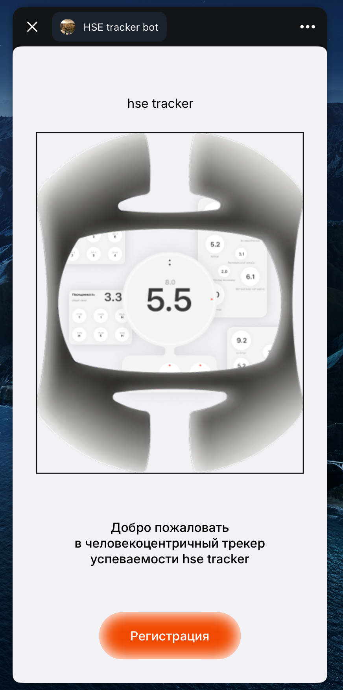

## Список технологий

- Vite
- Vue 3
- Tailwind CSS

## Запуск

Запускать из директории `app`

Приложение разрабатывалось в формате Telegram Mini App, поэтому при тестировании нужно использовать DevTools -> Dimensions -> любой мобильный формат

Для запуска нужно открыть 2 окна в терминале:

1 окно (back)
```
cd mock-backend
go run main.go
```

2 окно (front)
```
cd mini-app
npm install
npm run dev
```

## Скриншот стартовой страницы

